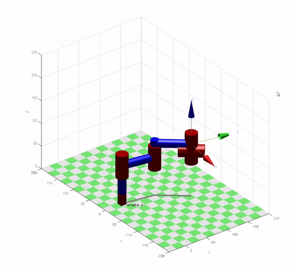
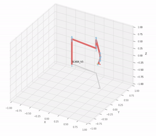

# 6DOF-SCARA-V3-RoboticsToolbox

Visualization: SCARA V3 Simulation in Robotics Toolbox

The library used in this MATLAB and python program is [Robotics Toolbox by Peter Corke](https://github.com/petercorke/robotics-toolbox-matlab).

You need to have Robotics Toolbox library by Peter Corke to run the program.

